# umap-go

`umap-go` is a pure-Go implementation of Uniform Manifold Approximation and Projection (UMAP).

This project was built with a strict mandate: achieve **exact mathematical parity** with the reference Python `umap-learn` library (pinned to v0.5.11) and its underlying `pynndescent` neighbor search. It is designed to be highly accurate, reproducible, and dependency-free (pure Go, no CGO).

## Features

- **Pure Go:** No reliance on CGO, Cython, or external C libraries.
- **Mathematical Parity:** Built to replicate the exact float math, graph constructions, and algorithmic stages of Python's UMAP, including exact PRNG sequence replication for reproducibility.
- **Complete Fit & Transform:** Supports training a model (`Fit` / `FitTransform`) and mapping new, out-of-sample data into an existing embedding space (`Transform`).
- **Custom NN-Descent:** Includes a fully replicated PyNNDescent implementation, including RP-Trees, graph-informed Hub Trees, and constrained graph search for exact nearest neighbor approximations.
- **Metrics:** Supports all standard UMAP distance metrics (Euclidean, Cosine, etc.).

## Installation

```bash
go get github.com/nozzle/umap-go
```

## Capability Matrix

| Capability | Status | Notes |
| --- | --- | --- |
| `Fit(X)` / `FitTransform(X, nil)` | Supported | Unsupervised training and embedding generation. |
| `FitTransform(X, y)` | Supported | Supervised mode (`y []float64`) via target-graph intersection. |
| `Transform(XNew)` | Supported | Out-of-sample mapping after `Fit`/`FitTransform`. |
| `InverseTransform(XEmbedded)` | Deferred | Method currently returns `umap: InverseTransform not yet implemented`; deferred while a pure-Go replacement for Python's Delaunay/QHull path is unresolved. |

## Reproducibility (seeded `RandSource`)

Use a fixed seed for deterministic runs:

```go
seed := uint64(42)
opts := umap.DefaultOptions()
opts.RandSource = umaprand.NewProduction(&seed)
model := umap.New(opts)
```

For repeatable independent runs, create a fresh `RandSource` from the same seed per run (do not reuse a previously advanced source).

## Usage

```go
package main

import (
	"github.com/nozzle/umap-go"
	umaprand "github.com/nozzle/umap-go/rand"
)

func seededOptions(seed uint64) umap.Options {
	opts := umap.DefaultOptions()
	opts.RandSource = umaprand.NewProduction(&seed)
	return opts
}
```

### 1) Unsupervised `Fit` and `FitTransform`

```go
var X [][]float64

modelA := umap.New(seededOptions(42))
if err := modelA.Fit(X); err != nil {
	panic(err)
}
embeddingA := modelA.Embedding()

modelB := umap.New(seededOptions(42))
embeddingB, err := modelB.FitTransform(X, nil)
if err != nil {
	panic(err)
}
_ = embeddingA
_ = embeddingB
```

### 2) Supervised `FitTransform`

```go
var X [][]float64
var y []float64 // class labels or continuous targets

model := umap.New(seededOptions(42))
embedding, err := model.FitTransform(X, y)
if err != nil {
	panic(err)
}
_ = embedding
```

### 3) Out-of-sample `Transform`

```go
var XTrain, XNew [][]float64

model := umap.New(seededOptions(42))
_, err := model.FitTransform(XTrain, nil)
if err != nil {
	panic(err)
}

newEmbedding, err := model.Transform(XNew)
if err != nil {
	panic(err)
}
_ = newEmbedding
```

## Parallel execution

The library can use multiple CPU cores for parallel-capable stages.

- `Options.NWorkers`: number of workers (default: `runtime.GOMAXPROCS(0)`)
- `Options.ParallelMode`:
  - `"auto"` (default): use deterministic parallel paths where available
  - `"serial"`: force single-thread behavior
  - `"parallel"`: favor throughput for parallel-capable paths

Example:

```go
opts := umap.DefaultOptions()
opts.NWorkers = runtime.GOMAXPROCS(0) // auto CPU count
opts.ParallelMode = "auto"
```

## Python vs Go FitTransform benchmark

This repository includes a benchmark comparison for `FitTransform`:

- Python runner: `testdata/benchmark_fit_transform.py` (`umap-learn==0.5.11`)
- Go benchmark: `BenchmarkFitTransformCompare`
- Parallel-mode benchmark: `BenchmarkFitTransformParallelModes`
- Worker-count benchmark: `BenchmarkFitTransformWorkerCounts`
- Python worker-count runner: `testdata/benchmark_fit_transform_worker_counts.py`

Run from repository root:

```bash
go test -run '^$' -bench BenchmarkFitTransformCompare -benchmem .
go test -run '^$' -bench BenchmarkFitTransformParallelModes -benchmem .
go test -run '^$' -bench BenchmarkFitTransformWorkerCounts -benchmem .
python3 testdata/benchmark_worker_counts_readme.py --update-readme
```

When Python tooling is available (`uv` or `python3` with `testdata` dependencies),
the Go benchmark reports extra metrics:

- `py_ns/op`: Python mean nanoseconds per operation
- `go_ns/op`: Go mean nanoseconds per operation
- `py/go`: Python-to-Go time ratio

If Python dependencies are unavailable, the benchmark still runs and reports Go-only metrics.

### Worker count scaling (FitTransform)

The section below is generated by `testdata/benchmark_worker_counts_readme.py`
from `BenchmarkFitTransformWorkerCounts` and Python `umap-learn` worker-count runs.

For Python worker scaling, `random_state` is intentionally unset because
`umap-learn` forces `n_jobs=1` when `random_state` is set.

<!-- benchmark-worker-counts:start -->

_Environment: darwin/arm64 on Apple M3 Max; Go command: `go test -run ^$ -bench ^BenchmarkFitTransformWorkerCounts$ -benchmem -count=1 .`; Python command: `uv run --directory testdata python benchmark_fit_transform_worker_counts.py`._

| Workers | Go ns/op | Go speedup vs 1 | Python ns/op | Python speedup vs 1 | Python/Go | Go B/op | Go allocs/op |
| --- | ---: | ---: | ---: | ---: | ---: | ---: | ---: |
| 1 | 176,903,696 | 1.00x | 77,777,983 | 1.00x | 0.44x | 12,967,797 | 10,613 |
| 2 | 112,461,212 | 1.57x | 56,082,200 | 1.39x | 0.50x | 20,300,187 | 42,002 |
| 4 | 83,422,583 | 2.12x | 47,916,275 | 1.62x | 0.57x | 21,419,971 | 43,003 |
| 8 | 71,069,789 | 2.49x | 45,046,549 | 1.73x | 0.63x | 23,658,834 | 45,001 |
| auto | 73,158,011 | 2.42x | 46,056,166 | 1.69x | 0.63x | 26,943,766 | 47,999 |

```mermaid
xychart-beta
    title "FitTransform ns/op by worker count (Go vs Python; lower is better)"
    x-axis ["1", "2", "4", "8", "auto"]
    y-axis "ns/op" 0 --> 194594065
    bar [176903696, 112461212, 83422583, 71069789, 73158011]
    bar [77777983, 56082200, 47916275, 45046549, 46056166]
```



_Mermaid bar order: first series is Go, second series is Python (umap-learn)._

<!-- benchmark-worker-counts:end -->

## License

This project is licensed under the BSD 3-Clause License. See [LICENSE](./LICENSE).

## Credits / Upstream Attribution

This library is a pure-Go port built for mathematical parity with:

- [`umap-learn` (v0.5.11)](https://github.com/lmcinnes/umap) — BSD 3-Clause
- [`pynndescent`](https://github.com/lmcinnes/pynndescent) — BSD 2-Clause

`umap-go` is an independent implementation and is not affiliated with or endorsed by the upstream projects.
